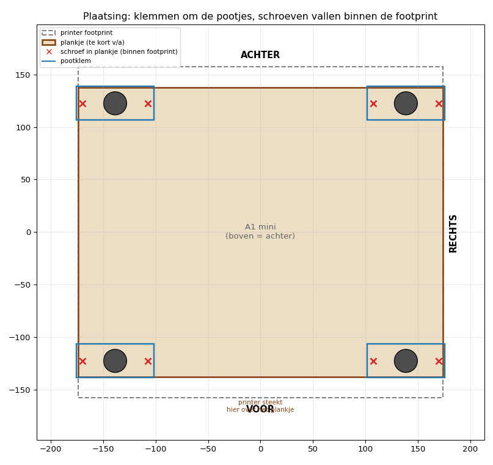
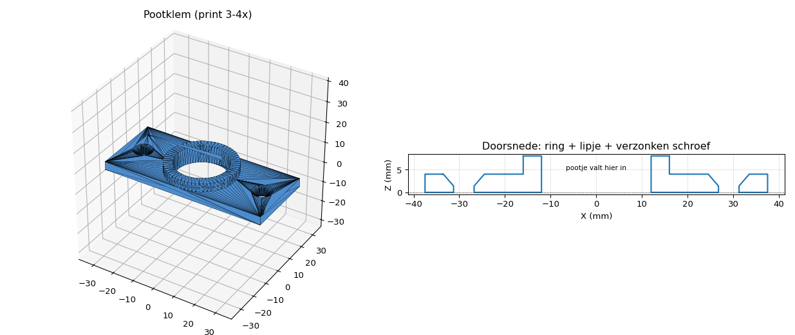

# A1 mini boot-montage — pootklemmen

3D-printbare klemmetjes om een **Bambu Lab A1 mini** vast te zetten op een (te krap)
plankje op een zeilboot, zodat de printer blijft staan als de boot slagzij maakt.

## Waarom dit concept

Het plankje is een paar cm **korter dan de printer lang is**, dus je kunt vóór en
achter **niet buiten de printer** in het plankje schroeven. Het enige wat altijd
**binnen de footprint** valt, zijn de **rubber pootjes** (die zitten naar binnen toe).

Daarom: een klemmetje dat **om elk pootje** valt en er met 2 houtschroeven **naast**
in het plankje wordt geschroefd. De klem is tegelijk je steun vóór, achter én rechts —
het schroeven gebeurt automatisch binnen de footprint.

### Hoe het werkt
- De **ring** valt om het pootje → de printer kan niet meer schuiven (alle richtingen).
- Het pootje staat via het **gat dóór** op het plankje (geen hoogteverschil), dus je
  hoeft niet per se alle vier de poten te klemmen — 3 (voor/achter/rechts) kan ook.
- Het **lipje** bovenaan grijpt licht over de bovenrand van het pootje → houdt 'm ook
  omlaag tegen optillen bij slagzij. (Zet `LIP=0` als je 'm gewoon wilt laten zakken.)

## Printen & monteren

1. **Meet je pootje**: diameter (`VOET_D`) en hoogte (`VOET_H`). Pas ze aan in `pootklem.py` en draai `python3 pootklem.py`.
2. **Print 3–4 stuks** van `pootklem.stl`. Klein deel (~75×32×8 mm), ~10 min elk.
   - PETG of ASA (boot = vocht/warmte). 3 wanden, 30 % infill. Plaat-kant op het bed, support niet nodig.
3. Zet de printer op het plankje, schuif elke klem om een pootje.
4. Teken de schroefgaten af, voorboren, en schroef elke klem vast met **2 houtschroeven (Ø4 mm, RVS)**. De koppen verzinken vlak.
5. Klaar — de printer zit geborgd tegen schuiven.

## Maten (pas aan na meten)

Bovenin `pootklem.py`:

| Parameter | Wat | Default |
|---|---|---|
| `VOET_D` | diameter rubber pootje | 22 mm |
| `VOET_H` | hoogte pootje (= ringhoogte) | 8 mm |
| `SPELING` | speling pootje ↔ ring | 1 mm |
| `WAND` | wanddikte ring | 4 mm |
| `LIP` / `LIP_DIK` | anti-optil-lipje (0 = uit) | 1,5 / 2 mm |
| `TAB_LEN` | lengte schroeftabs | 26 mm |
| `SCHROEF_D` | doorvoergat houtschroef | 4,5 mm |

## Extra zekerheid bij flinke slagzij

De klemmen borgen tegen **schuiven**; voor échte storm/omkiep-zekerheid raad ik extra
een **spanband** over de printer aan (of vervang de pootschroef door een langere die
dóór de klem in de basis grijpt, als jouw pootjes zo zijn opgebouwd). Het lipje helpt,
maar een band is de zekerste hold-down.

## Ander idee nodig?

Steekt het plankje érgens wél buiten de printer uit (bijv. rechts)? Dan kan ik daar een
hogere **zijwand-beugel** bijmaken die tegen de basis drukt. Of een complete **bak/cradle**
in delen. Laat maar weten.

> ⚠️ Maten van de A1 mini (347×315×365 mm) en de poot zijn **indicatief / te meten**.
> Het model is volledig parametrisch, dus na het opmeten is het één getal aanpassen.
