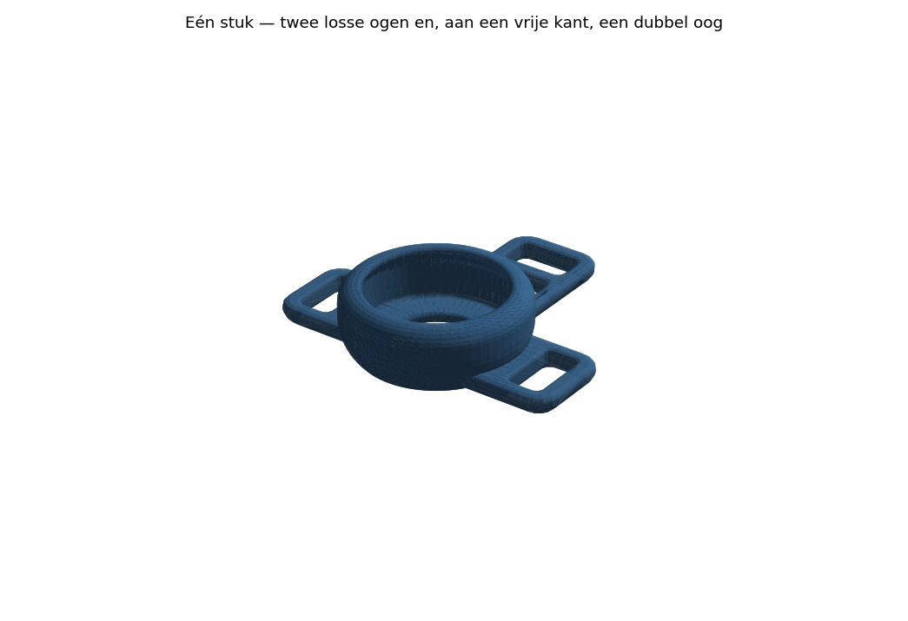
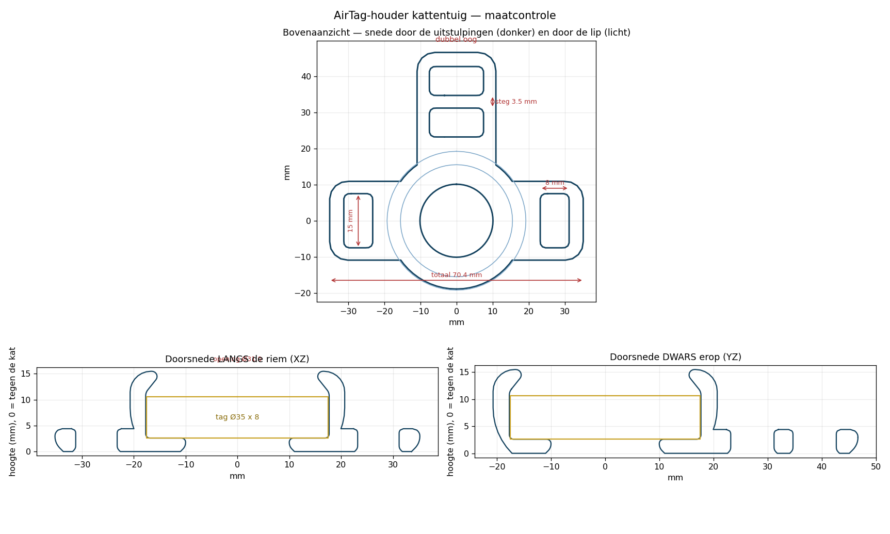
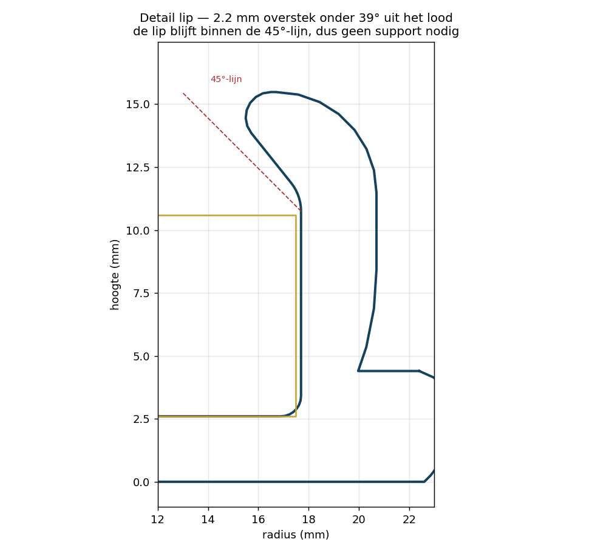

# AirTag-houder voor een kattentuigje — TPU

Eén stuk, **geen support en nergens een brug**. Voor een B-merk tracker van
**Ø35 × 8 mm**, met drie bevestigingspunten: aan weerszijden een los oog van
**15 × 8 mm**, en aan een vrije kant een **dubbel oog** van twee keer dezelfde maat.
(8 mm zodat ook de sluitclip van het tuigje erdoorheen kan.)



## Hoe het in elkaar zit

Een ronde bak waar de tag van bovenaf onder een rondlopende lip in wordt gedrukt.
Alle gaten staan **rechtop**, dus er wordt nergens iets overbrugd, en je bepaalt zelf
of de riem **onder** of **boven** de houder langs loopt.

### Twee manieren om hem op het tuigje te zetten (v8)

- **Over de twee losse ogen**, links en rechts. De riem loopt dan door beide, over de
  volle 70 mm. Ligt strak, maar vraagt wel een recht stuk riem van 7 cm.
- **Door het dubbele oog** aan de vrije kant. Twee openingen van 15 × 8 mm met een
  steg van 3,5 mm ertussen: door de ene omhoog, om de steg heen, door de andere terug
  omlaag — net als een tri-glide. Daarmee klem je de houder op een **kort stuk riem**,
  op elke plek van het tuigje die je wilt, en hij blijft daar zitten.

Het dubbele oog steekt 26 mm buiten de bak uit, dus de houder is over die kant
67,4 mm breed geworden. Wordt dat te veel op de kat: de twee losse ogen kunnen weg
door in `airtag_houder.py` de lus in `tabplattegrond()`/`riemgaten()` over te slaan,
of zet `DUBBEL_OOG = False` als je juist het dubbele oog niet wilt.

Onder in de bak zit een gat van Ø20 mm om de tag er weer uit te duwen. Loopt de riem
onder de houder door, dan drukt die riem meteen tegen de achterkant van de tag.



## De ronde bak is een kiezel geworden (v7)

De bak heeft nu zijn eigen, veel ruimere aanloop dan de uitstulpingen:

| | v6 | nu |
|---|---|---|
| **bak: radius van de aanloop** | r3,2 | **r11,9** — bijna 4× |
| **bak: inzet op laag 1** | 1,6 mm | **3,5 mm** |
| **bak: over welke hoogte hij wegrolt** | 2,93 mm | **8,43 mm** |
| bovenrand van de bak, buitenkant | r3,2 | **r4,0** (= de hele wanddikte) |
| uitstulpingen: aanloop | 1,6 / r3,2 | ongewijzigd |
| lip, liptip, vloerhoek | r1,8 / r1,0 / r0,8 | ongewijzigd |

Er zit **geen recht stuk wand meer in de bak**. Hij loopt van de bodem in één bocht
naar buiten tot Ø41,4 op ongeveer 8 mm hoogte, en van daar in één bocht over de
bovenrand naar de lip. In doorsnede is het een kiezel geworden in plaats van een
potje met gebroken randen.

De uitstulpingen konden niet mee: die zijn 4,4 mm dik, daar past een bocht van
r11,9 simpelweg niet in. Ze zitten daarom niet langer in dezelfde omtrek als de bak
— anders zou hun kleine aanloop die van de bak overschrijven. Ze groeien nu uit de
flank van de bak.

**Wat nog steeds niet kan:** een echte afronding op laag 1. Die begint als een
flintertje en krult om. De aanloop start dus nog steeds met een recht stuk van
precies 45°, alleen buigt hij daarna veel geleidelijker weg.

### Wat het kost

| | v6 | nu |
|---|---|---|
| hoogte | 15,48 | 15,48 |
| bak Ø | 40,2 | 41,4 |
| totale lengte | 69,2 | 70,4 |
| wanddikte rond de tagholte | 2,4 | 3,0 (dunste plek 1,78) |
| bodemdikte | 1,8 | 2,6 |

Die laatste twee zijn geen luxe maar noodzaak: een grote aanloop eet radiaal in de
wand rond de tagholte. Met de oude wand van 2,4 mm bleef er bij r11,9 nog maar
0,9 mm over. `airtag_houder.py` rekent die dunste plek nu zelf uit en zet hem in de
uitvoer, zodat je het meteen ziet als je aan de knoppen draait:

```
wanddikte rond de tagholte: minimaal 1.78 mm (op z=3.0) -> ruim genoeg
```

Het contactvlak tegen de kat blijft ~9,0 cm².

## Overhang: gecontroleerd, geen support

`airtag_houder.py` meet zelf na hoeveel neerwaarts vlak er steiler dan 45° staat:

```
overhangcontrole: 0.00 mm2 van 1827 mm2 neerwaarts vlak staat steiler dan 46°
                  -> GEEN support nodig
```

De grens staat op 46° en niet op 45°, omdat de aanloop aan de bedzijde met opzet
precies 45° is — door afrondingsruis vallen die facetten anders willekeurig net aan
de verkeerde kant van de grens. Wat er overblijft is 0,12 mm² aan splinters op de
overgangen. De lip zelf staat op 39° uit het lood.



## Maten

| | mm |
|---|---|
| totaal | 70,4 × 67,4, ronde bak Ø 41,4 |
| hoogte | 15,48 |
| dikte uitstulpingen | 4,4 |
| riemgaten | 4 × (15 × 8), hoeken r1,5 |
| steg in het dubbele oog | 3,5 |
| tagholte | Ø 35,4 × 8,15 |
| nauwste opening onder de lip | Ø 31,0 |
| lip | 2,2 mm overstek onder 39° |
| gewicht | ~9,9 cm³, geprint ongeveer 7–9 g |

## Printen (TPU)

De STL staat goed op het bed: **platte onderkant naar beneden, opening omhoog**.

- **TPU 95A**, laag 0,2 mm, **3 wanden**, 25–30 % infill.
- Langzaam: 20–30 mm/s, retractie zo goed als uit, direct drive.
- Support: **uit**.
- Print op een schoon bed met een dun laagje lijm — TPU hecht anders juist te goed.

## Als het niet past

Alle maten staan bovenin `airtag_houder.py`. Aanpassen en `python3 airtag_houder.py`
draaien geeft een nieuwe STL.

| Parameter | Wat | Nu |
|---|---|---|
| `TAG_D` / `TAG_H` | maat van je tracker | 35 / 8 |
| `SPEL_D` / `SPEL_H` | speling om de tag | 0,4 / 0,15 |
| `LIP` | hoeveel de lip over de tag valt | 2,2 |
| `LIP_HELLING` | dr/dz van de lip; 1,0 = 45° | 0,8 |
| `ROND_RAND` | bovenrand van de bak | 4,0 |
| `ROND_LIP` / `ROND_TIP` / `ROND_VLOER` | rondingen rond de tag | 1,8 / 1,0 / 0,8 |
| `AFSCH_BAK` / `ROND_BAK` | **aanloop van de bak**: inzet op laag 1 / radius | 3,5 / 11,9 |
| `AFSCH_ONDER` / `ROND_ONDER` | idem voor de uitstulpingen | 1,6 / 3,2 |
| `AFSCH_GAT` / `ROND_GAT` | idem voor de riemgaten | 0,6 / 1,2 |
| `AFSCH_DRUK` / `ROND_DRUK` | idem voor het uitduwgat | 1,0 / 1,8 |
| `GAT_B` / `GAT_L` | riemgat breed × lang | 15 / 8 |
| `UITSTULP_B` / `UITSTULP_D` | uitstulping breed / dik | 22 / 4,4 |
| `WAND` / `BODEM` | wand rond de tagholte / bodemdikte | 3,0 / 2,6 |
| `DRUK_D` | uitduwgat in de bodem (0 = dicht) | 20 |
| `DUBBEL_OOG` / `OOG_KANT` / `RAND_MID` | dubbel oog aan/uit, welke kant, steg | True / +Y / 3,5 |

**Bak nog ronder?** `AFSCH_BAK` omhoog en `ROND_BAK` mee (maximaal 3,41 × `AFSCH_BAK`,
anders start laag 1 steiler dan 45°). Kijk daarna naar de regel *wanddikte rond de
tagholte* in de uitvoer: zakt die onder ~1,6 mm, zet dan `WAND` of `BODEM` omhoog.
**Uitstulpingen ronder?** `AFSCH_ONDER` / `ROND_ONDER` omhoog, maar `UITSTULP_D` moet
minstens de aanlooplengte + `ROND_TAB` zijn en het materiaal tussen gat en rand wordt
kleiner (`UITSTULP_B` mee omhoog of `AFSCH_GAT` omlaag).
**Valt de tag eruit?** `LIP` naar 2,6. **Te stug erin?** `LIP` naar 1,8.

## Opnieuw genereren

```bash
pip install --break-system-packages numpy shapely trimesh manifold3d mapbox_earcut matplotlib
python3 airtag_houder.py     # schrijft airtag_houder.stl
python3 render.py            # previews + doorsneden
```
