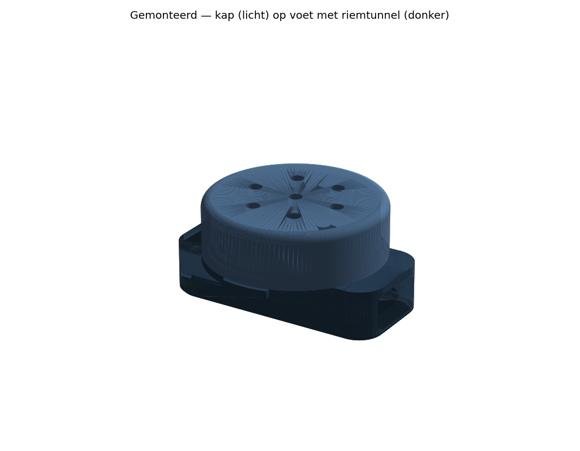
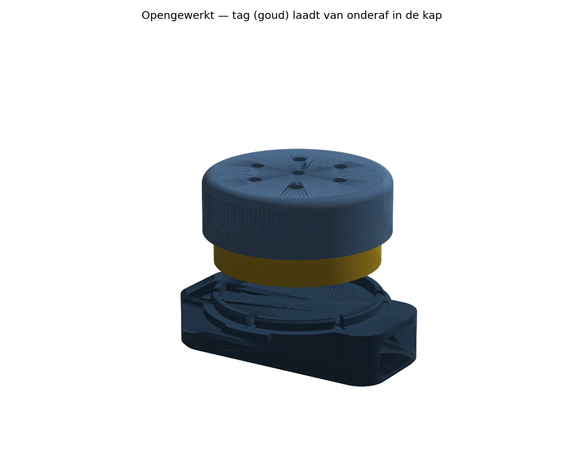
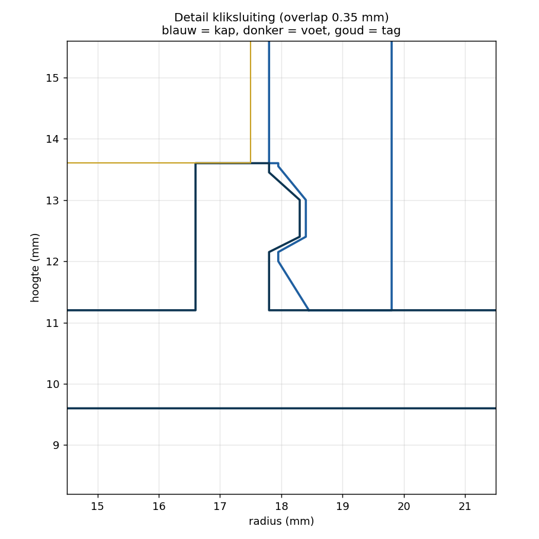

# AirTag-houder voor een kattentuigje

Houder voor een B-merk tracker van **Ø35 × 8 mm**, met een **riemsleuf van 15 × 8 mm**
dwars door de onderkant — precies zoals gevraagd, alleen dan als één doorlopende tunnel
tussen de twee uitstulpingen in plaats van twee losse lusjes.

## Hoe het werkt

Twee delen die op elkaar klikken:

| Deel | Wat |
|---|---|
| **KAP** (`airtag_kap.stl`) | ronde kap met de holte voor de tag, zit aan de buitenkant |
| **VOET** (`airtag_voet.stl`) | bodemplaat met daaronder de riemtunnel; klikt in de kap |

De riem gaat er dwars doorheen, dus de houder **kan niet draaien of verschuiven**.
En omdat de tunnel aan de onderkant zit, drukt de riem (en de kat) de voet juist
**ín** de kap — de kliksluiting kan er in gebruik niet uitvallen.

De tag laadt van onderaf in: kap eraf, tag erin, voet erop drukken tot hij klikt.

## Maten

| | mm |
|---|---|
| totale hoogte | 23,5 (waarvan 8 de riemsleuf zelf) |
| hoogte bóven de riem (steekt uit) | 13,9 |
| dikte tussen riem en kat | 1,6 |
| buitenmaat | 49,6 × 39,6 (rond deel Ø 39,6) |
| riemsleuf | 15 breed × 8 hoog, hoeken r1,5 |
| gewicht massief | ~5 g (kap) + ~10 g (voet) — geprint met infill eerder 10–12 g totaal |

## Details die erin zitten

- **Kliksluiting** met een nok van 0,35 mm: steile kant naar onderen (houdt vast),
  flauwe oploop naar boven (klikt makkelijk dicht). De klikrand is 1,2 mm dun met
  6 veersleufjes, zodat hij veert in plaats van breekt.
  
- **2 duimnageltjes** op de flens (haaks op de riem) om de kap er weer af te wippen.
- **7 geluidsgaatjes** in de bovenplaat — anders hoor je de piep van de tracker
  nauwelijks. Ze dienen meteen als uitdrukgaatjes: pen erdoor = tag eruit.
- **3 bultjes** tegen de bovenplaat zodat de tag niet rammelt.
- Afgeronde bovenrand (r2) en een afgeschuinde onderrand aan de kant van de kat.

## Printen

Beide STL's staan al goed op het bed en hebben **geen support** nodig.

- **KAP**: platte bovenkant op het bed, holte omhoog.
- **VOET**: tunnelbodem op het bed, klikrand omhoog. Het tunneldak is een vlakke
  brug van 15 mm — dat overbrugt elke printer zonder support prima.

Instellingen: laag 0,2 mm, **3 wanden** (belangrijk voor de klikrand), 20–30 % infill.
Materiaal: **PETG of ASA** (buiten, vocht, UV). PLA kan ook maar wordt bros in de zon.
Wil je het zachter voor de kat? Print de **voet in TPU 95A** en de kap in PETG — dat
klikt nog steeds en de kant tegen de kat is dan flexibel.

Printtijd samen ongeveer een half uur.

## Als het niet past

Alles staat bovenin `airtag_houder.py`; één keer `python3 airtag_houder.py` draaien
geeft nieuwe STL's.

| Parameter | Wat | Nu |
|---|---|---|
| `TAG_D` / `TAG_H` | maat van je tracker | 35 / 8 |
| `SPEL_D` / `SPEL_H` | speling om de tag | 0,6 / 0,3 |
| `SLEUF_B` / `SLEUF_H` | riemsleuf | 15 / 8 |
| `UITSTEEK` | hoever de tunnel buiten de kap steekt | 5 |
| `KLIK` | hoe stug hij vastklikt (radiale overlap) | 0,35 |
| `GELUID_D` | geluidsgaatjes, 0 = dicht | 3 |

**Klikt hij te stug of te los?** Verander alleen `KLIK` — 0,25 is losser, 0,45 stugger.
**Tag te los in de holte?** `SPEL_D` naar 0,4.

## Twee dingen om te weten

1. **8 mm sleufhoogte is ruim.** Een gewoon kattentuigje heeft een bandje van
   ~1,5–2 mm dik. Dan zit de houder los op de riem en kan hij heen en weer glijden
   (niet draaien — dat gaat niet). Meet je bandje en zet `SLEUF_H` op *dikte + 1 mm*,
   dan zit hij strak. Of leg er een stukje rubber/fietsband onder als vulling.
2. **Weeg het geheel.** Houder + tag komt op ongeveer 20–25 g. Voor een volwassen kat
   is dat prima; voor een klein of jong dier is het merkbaar. Gebruik dit alleen op een
   tuigje met veiligheidssluiting (breakaway), niet op een vaste halsband, en check de
   eerste dagen of er niets schuurt.
