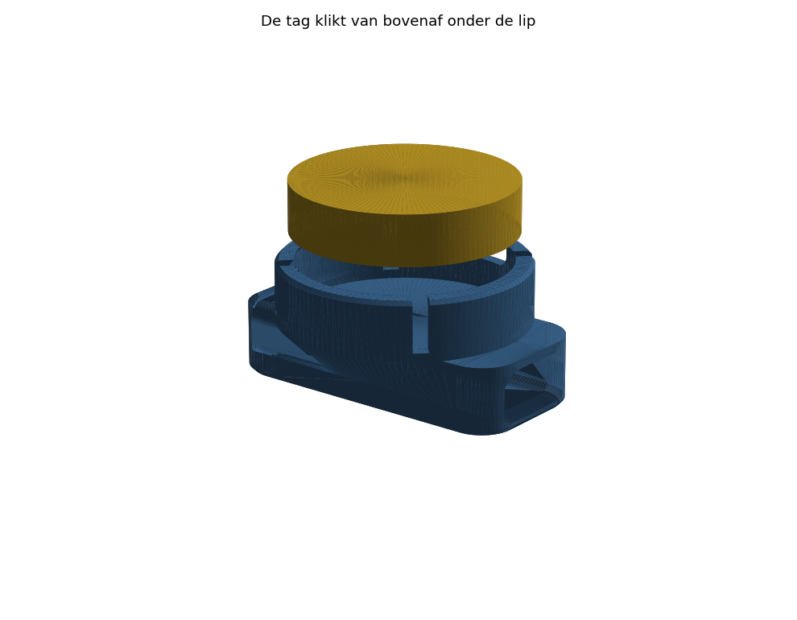

# AirTag-houder voor een kattentuigje

Eén stuk, **geen support, geen losse delen**. Voor een B-merk tracker van
**Ø35 × 8 mm** aan een riem van **15 mm** breed.

De tag klikt van bovenaf in en wordt vastgehouden door een rondlopende lip.
Die lip loopt **42° uit het lood** naar binnen — elke laag steunt dus op de vorige,
en de printer heeft nergens support nodig.

De riem gaat er dwars onderdoor. Doordat het één doorlopende tunnel is over de volle
49 mm, kan de houder **niet draaien en niet kantelen** op het tuigje.

## Maten

| | mm |
|---|---|
| totale hoogte | 20,2 |
| hoogte bóven de riem | 10,8 |
| buitenmaat | 49,2 × 39,2 (rond deel Ø 39,2) |
| riemsleuf | 15 breed × 8 hoog |
| tagholte | Ø 35,6 × 8,15 |
| opening (onder de lip door) | Ø 33,4 |
| gewicht | ~9 cm³, geprint ongeveer 7–9 g |

## Waarom het zonder support print

Er zit maar één echte uitdaging in en die is opgelost:

- **De lip over de tag** gaat met 0,9 mm naar binnen per mm hoogte. Dat is 42° uit het
  lood, dus ruim binnen de 45° die elke printer aankan. In de doorsnede hieronder ligt
  de lip netjes binnen de 45°-referentielijn.
  
- **De 45°-overgang** van de smalle riemtunnel naar de ronde bak is precies 45°.
- **Het dak van de riemtunnel** is het enige stukje dat overbrugd wordt. De bovenhoeken
  van de sleuf zijn 2 mm afgeschuind, dus er blijft ~11 mm vlakke brug over. Dat doet
  elke printer zonder support.

## De tag erin en eruit

- **Erin**: kantel de tag, schuif één rand onder de lip en druk de andere kant aan tot
  hij klikt. De wand heeft **4 veersleuven** zodat de rand meegeeft.
- **Eruit**: aan één kant (haaks op de riem) zit een **duimuitsparing**. Duim erop,
  tag kantelt eruit.

De veersleuven en de uitsparing laten meteen het piepje van de tracker goed door.

## Printen

De STL staat al goed op het bed: **platte onderkant naar beneden, opening omhoog**.

- Laag 0,2 mm, **3 wanden** (belangrijk — die wand moet veren, niet knappen), 20–25 % infill.
- **PETG of ASA**: blijft taai en kan tegen vocht en zon. PLA kan ook, maar wordt bros
  in de zon en dan breekt de lip een keer af.
- Support: **uit**. Brug-instellingen op standaard.
- Printtijd ongeveer 25 minuten.

## Als het niet past

Alle maten staan bovenin `airtag_houder.py`. Aanpassen en één keer
`python3 airtag_houder.py` draaien geeft een nieuwe STL.

| Parameter | Wat | Nu |
|---|---|---|
| `TAG_D` / `TAG_H` | maat van je tracker | 35 / 8 |
| `SPEL_D` / `SPEL_H` | speling om de tag | 0,6 / 0,15 |
| `LIP` | hoeveel de lip over de tag valt | 1,1 |
| `LIP_HELLING` | dr/dz van de lip; 1,0 = precies 45° | 0,9 |
| `SLEUF_B` / `SLEUF_H` | riemsleuf | 15 / 8 |
| `UITSTEEK` | hoever de tunnel buiten de bak steekt | 5 |
| `N_VEER` / `VEER_B` | veersleuven in de wand | 4 / 2,5 |
| `DUIM_B` / `DUIM_DIEP` | duimuitsparing (0 = geen) | 14 / 4,6 |

**Valt de tag eruit?** `LIP` naar 1,4. **Krijg je hem er niet in?** `LIP` naar 0,8,
of `N_VEER` naar 6 (meer sleuven = soepelere rand).
**Rammelt de tag?** `SPEL_H` naar 0,05.

## Twee dingen om te weten

1. **8 mm sleufhoogte is ruim.** Een kattentuigje heeft meestal een bandje van
   1,5–2 mm dik; dan kan de houder over de riem heen en weer glijden (draaien niet,
   dat gaat niet meer). Meet je bandje en zet `SLEUF_H` op *dikte + 1 mm* als je
   wilt dat hij op z'n plek blijft.
2. **Weeg het geheel even.** Houder plus tag komt op ongeveer 15 g. Prima voor een
   volwassen kat; gebruik het op een tuigje met veiligheidssluiting en kijk de eerste
   dagen of er niets schuurt.
